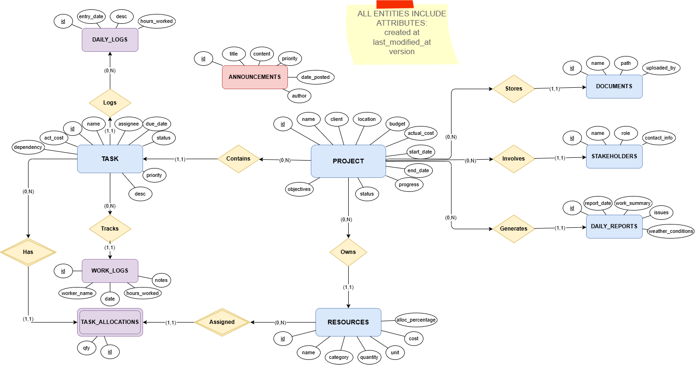

# ConstructFlow - Construction Project Management System

<div align="center">

**A comprehensive web-based construction project management platform built with Spring Boot and Next.js**

[](https://spring.io/projects/spring-boot)
[](https://nextjs.org/)
[](https://www.oracle.com/java/)
[](https://www.typescriptlang.org/)

</div>

---

## 📋 Table of Contents

- [Overview](#overview)
- [Key Features](#key-features)
- [Tech Stack](#tech-stack)
- [Backend Architecture Refactor](#backend-architecture-refactor)
- [Prerequisites](#prerequisites)
- [Installation](#installation)
- [Configuration](#configuration)
- [Project Structure](#project-structure)
- [API Documentation](#api-documentation)
- [Usage Guide](#usage-guide)
- [Database Schema](#database-schema)
- [Troubleshooting](#troubleshooting)
- [Contributing](#contributing)

---

## 🎯 Overview

**ConstructFlow** is a full-stack construction project management system designed to streamline project planning, task coordination, resource management, and team communication for construction companies. The application provides real-time collaboration tools, comprehensive reporting, and data-driven insights to optimize construction workflows.

### Why ConstructFlow?

- **Centralized Management**: Manage all projects, tasks, and resources in one place
- **Real-Time Collaboration**: Discussion threads and announcements keep teams connected
- **Data-Driven Insights**: Analytics dashboards and executive reports for informed decision-making
- **Resource Optimization**: Track materials, equipment, and labor across all projects
- **Automated Logging**: Daily activity tracking with automatic change detection

---

## ✨ Key Features

### 🏗️ **Project Management**
- Create and track multiple construction projects
- Monitor budget vs. actual costs in real-time
- Set project timelines with start/end dates
- Track project progress with completion percentages
- Manage project stakeholders and client information

### ✅ **Task Management**
- Create and assign tasks to specific projects
- **Four priority levels**: Low, Medium, High, **Critical**
- Track task status: Pending, In Progress, Completed
- Set due dates and assign team members
- Allocate resources to specific tasks
- Dedicated **Critical Tasks** dashboard section

### 📦 **Resource Management**
- Manage three resource categories: Materials, Equipment, Labor
- Track resource quantities and costs
- Daily inventory updates
- Resource allocation to tasks
- Resource availability tracking

### 📄 **Document Management**
- Upload and organize project documents
- Folder-based document organization
- Search and filter documents
- Associate documents with specific projects

### 📊 **Reports & Analytics**

#### **Daily Reports**
- User-entered daily progress reports
- **Automatic change tracking**:
  - Projects created/modified
  - Tasks created/modified
  - Resources created/modified
- Real-time activity logs
- Issues and completion percentage tracking

#### **Global Reports (Executive Summary)**
- High-level KPIs (Total Budget, Active Projects, Pending Tasks)
- Financial health metrics with budget utilization
- Critical alerts for overdue tasks and budget overruns
- Print-friendly format for stakeholder presentations

### 💬 **Discussion Threads**
- Comment on announcements
- User-input author names
- Chronological discussion threads
- Delete comments functionality
- Real-time team communication

### 📢 **Announcements**
- System-wide announcements with priority levels
- Critical, High, and Normal priority tags
- Announcement board for team communication
- Discussion threads on each announcement

---

---

## 🏛 Backend Architecture Refactor

The Java backend underwent a full SOLID-compliance refactor introducing five classic design patterns. All changes shipped across 10 atomic commits. The full technical write-up lives in [`docs/ARCHITECTURE_AND_PATTERNS.md`](docs/ARCHITECTURE_AND_PATTERNS.md).

### What changed at a glance

| Pattern | Where | Effect |
|---|---|---|
| **Adapter** | `DocumentService` → `DocumentStorage` port | Storage backend swappable (NIO → S3/Azure) without touching the service |
| **Factory Method** | `EntityFactory<E,D>` → `TaskFactory`, `ProjectFactory`, `ResourceFactory` | Entity construction rules centralised; services reduced to one-liners |
| **Abstract Factory** | `ReportArtifactFactory` family | New report types (Executive/Project/Financial) added as new classes — no existing code edited |
| **Iterator** | `PagedRepositoryIterator`, `ProjectScanner`, `ProjectTaskTreeIterator` | `findAll()` removed; repositories paged lazily at O(1) memory |
| **Composite** | `WorkItem` / `LeafTask` / `CompositeTask` | Task subtree progress and cost aggregate recursively; `ProjectService` reduced to two lines |

### SOLID violations resolved

| Principle | Finding | Fix |
|---|---|---|
| **SRP** | `mapToResponseDTO` duplicated across all 13 services | Extracted to `service/mapping/XxxMapper` components |
| **SRP** | `DocumentService` mixed NIO I/O with JPA persistence | I/O moved to `LocalFileSystemStorageAdapter` |
| **SRP** | `GlobalReportService` queried, filtered, formatted, and debug-printed all in one method | Decomposed into iterators + `ReportService` + factory sections |
| **OCP** | Adding a report type required editing `GlobalReportService` | `ReportArtifactFactory` — new kind = new `@Component` |
| **DIP** | `TaskService` imported concrete `ProjectService` | Publishes `TaskMutatedEvent`; `ProgressRecalculator` listens with `@TransactionalEventListener` |
| **DIP** | `DocumentService` coupled to `java.nio.file` | Depends on `DocumentStorage` interface |
| **DIP** | `ResourceService.updateInventory` used `System.out.println` | Replaced with SLF4J `log.info` |
| Exceptions | `GlobalExceptionHandler` mapped everything to 500 | Three typed exceptions added: `ResourceNotFoundException` (404), `InsufficientResourceException` (422), `DomainValidationException` (400) |
| Config | Status strings and CORS origins hard-coded in Java | Externalised to `AppProperties` via `@ConfigurationProperties` |
| Security | `@CrossOrigin(origins = "*")` on every controller | Removed; global CORS config reads allowed origins from `application.properties` |

### New packages added

```
service/
├── events/      TaskMutatedEvent, ProgressRecalculator
├── factory/     EntityFactory, TaskFactory, ProjectFactory, ResourceFactory
│   └── report/  ReportArtifactFactory, ExecutiveReportFactory,
│                ProjectReportFactory, FinancialReportFactory,
│                ReportKind, ReportContext, ReportSection
├── iteration/   PagedRepositoryIterator, ProjectScanner, ProjectTaskTreeIterator
├── mapping/     ProjectMapper, TaskMapper, ResourceMapper, DocumentMapper,
│                DailyReportMapper, DailyLogMapper, WorkLogMapper,
│                StakeholderMapper, AnnouncementMapper
└── storage/     DocumentStorage (port), StoredFile, LocalFileSystemStorageAdapter

model/work/      WorkItem, LeafTask, CompositeTask, WorkItemVisitor

config/          AppProperties, StorageProperties (both @ConfigurationProperties)

exception/       ResourceNotFoundException, InsufficientResourceException,
                 DomainValidationException
```

### New API endpoints

| Method | Path | Description |
|---|---|---|
| `GET` | `/api/reports/EXECUTIVE` | Executive summary via factory (projects, budget, task health, recent activity) |
| `GET` | `/api/reports/PROJECT` | Project-focused report (counts, task progress, overdue alerts) |
| `GET` | `/api/reports/FINANCIAL` | Financial report (budget vs actual, cost utilisation %) |

The existing `GET /api/reports/summary` endpoint was retained and still returns `ExecutiveSummaryDTO`.

### Database changes

Two nullable columns were added to existing tables (Hibernate DDL auto-update handles this on startup):

| Table | Column | Purpose |
|---|---|---|
| `tasks` | `parent_task_id` (UUID, nullable) | Enables subtask relationships for the Composite tree |
| `documents` | `storage_key` (VARCHAR, nullable) | Stores the file path/key used by the storage adapter so deletion works correctly |

---

## 🛠 Tech Stack

### Backend
- **Framework**: Spring Boot 3.2.1
- **Language**: Java 21
- **ORM**: Hibernate / Spring Data JPA
- **Database**: Microsoft SQL Server
- **Build Tool**: Maven
- **API**: RESTful architecture with JSON

### Frontend
- **Framework**: Next.js 14 (React)
- **Language**: TypeScript
- **Styling**: Tailwind CSS
- **State Management**: React Context API
- **Icons**: Lucide React
- **HTTP Client**: Fetch API

### Database
- **RDBMS**: MS SQL Server 2019+
- **Schema Management**: Hibernate DDL Auto-update
- **Authentication**: SQL Server Authentication / Windows Authentication

---

## 📦 Prerequisites

Before you begin, ensure you have the following installed:

- **Node.js** v18.0.0 or higher
- **npm** v9.0.0 or higher
- **Java Development Kit (JDK)** 21
- **Apache Maven** 3.8+
- **Microsoft SQL Server** 2019+ (or SQL Server Express)
- **SQL Server Management Studio (SSMS)** or Azure Data Studio

### Verify Installations

```bash
node --version    # Should be v18+
npm --version     # Should be v9+
java --version    # Should be 21+
mvn --version     # Should be 3.8+
```

---

## 🚀 Installation

### 1. Clone the Repository

```bash
git clone <repository-url>
cd "Constructflow Project management"
```

### 2. Database Setup

#### Create Database

Open SQL Server Management Studio and run:

```sql
CREATE DATABASE ConstructFlowDB;
```

#### Configure Authentication

**Option A: SQL Server Authentication** (Recommended for development)

```sql
ALTER LOGIN sa WITH PASSWORD = 'YourStrongPassword123!';
ALTER LOGIN sa ENABLE;
```

**Option B: Windows Authentication**
- Ensure your Windows user has sysadmin rights on SQL Server

#### Run Schema Scripts (Optional)

```bash
# Execute schema and sample data scripts in SSMS
database_schema.sql
sample_data.sql
add_critical_tasks.sql
announcement_comments_schema.sql
```

> **Note**: Hibernate will auto-create tables on first run if DDL auto-update is enabled.

### 3. Backend Setup

```bash
cd backend

# Configure database connection
# Edit src/main/resources/application.properties
# See Configuration section below

# Build the project
mvn clean install

# Run the backend server
mvn spring-boot:run
```

The backend will start on `http://localhost:8080`

### 4. Frontend Setup

```bash
cd "../construct-flow-wireframe (1)"

# Install dependencies
npm install

# Run the development server
npm run dev
```

The frontend will start on `http://localhost:3000`

### 5. Access the Application

Open your browser and navigate to:
```
http://localhost:3000
```

---

## ⚙️ Configuration

### Backend Configuration

Edit `backend/src/main/resources/application.properties`:

#### SQL Server Authentication

```properties
spring.application.name=backend
spring.datasource.url=jdbc:sqlserver://localhost:1433;databaseName=ConstructFlowDB;encrypt=true;trustServerCertificate=true;
spring.datasource.username=sa
spring.datasource.password=YourStrongPassword123!
spring.jpa.database-platform=org.hibernate.dialect.SQLServerDialect
spring.jpa.hibernate.ddl-auto=update
spring.jpa.show-sql=true
```

#### Windows Authentication

```properties
spring.datasource.url=jdbc:sqlserver://localhost:1433;databaseName=ConstructFlowDB;encrypt=true;trustServerCertificate=true;integratedSecurity=true;
```

#### Named SQL Server Instance

```properties
spring.datasource.url=jdbc:sqlserver://localhost\\YOUR_INSTANCE_NAME;databaseName=ConstructFlowDB;encrypt=true;trustServerCertificate=true;
```

### Frontend Configuration

API base URL is configured in `lib/api-service.ts`:

```typescript
const API_BASE_URL = 'http://localhost:8080/api';
```

### CORS Configuration

Allowed origins are configured in `application.properties` (not hard-coded):

```properties
app.cors.allowed-origins=http://localhost:3000,http://localhost:3001
```

---

## 📁 Project Structure

```
Constructflow-Project-Management/
├── backend/
│   ├── src/main/java/com/constructflow/
│   │   ├── controller/          # REST API endpoints (CORS handled globally)
│   │   ├── service/             # Business logic layer
│   │   │   ├── events/          # TaskMutatedEvent, ProgressRecalculator
│   │   │   ├── factory/         # EntityFactory + concrete factories
│   │   │   │   └── report/      # Abstract Factory — report families
│   │   │   ├── iteration/       # PagedRepositoryIterator, ProjectScanner
│   │   │   ├── mapping/         # XxxMapper components (one per aggregate)
│   │   │   └── storage/         # DocumentStorage port + adapters
│   │   ├── repository/          # Data access layer (JPA)
│   │   ├── model/               # Entity classes
│   │   │   └── work/            # Composite: WorkItem, LeafTask, CompositeTask
│   │   ├── dto/                 # Data Transfer Objects
│   │   ├── exception/           # GlobalExceptionHandler + domain exceptions
│   │   └── config/              # WebConfig, AppProperties, StorageProperties
│   ├── src/main/resources/
│   │   └── application.properties
│   └── pom.xml
│
└── construct-flow-nextjs-frontend/
    ├── app/                     # Next.js app directory
    │   └── page.tsx             # Main application page
    ├── components/              # React components
    │   ├── dashboard.tsx
    │   ├── projects-section.tsx
    │   ├── task-manager.tsx
    │   ├── resource-management.tsx
    │   ├── announcement-board.tsx
    │   ├── reports-section.tsx
    │   └── ...more components
    ├── lib/                     # Utilities and services
    │   ├── api-service.ts       # Backend API calls
    │   ├── app-context.tsx      # Global state management
    │   └── types.ts             # TypeScript interfaces
    ├── package.json
    └── tailwind.config.ts
```

---

## 📡 API Documentation

### Base URL
```
http://localhost:8080/api
```

### Endpoints Overview

#### Projects
- `GET /projects` - List all projects (paginated)
- `GET /projects/{id}` - Get project by ID
- `POST /projects` - Create new project
- `PUT /projects/{id}` - Update project
- `DELETE /projects/{id}` - Delete project

#### Tasks
- `GET /tasks` - List all tasks
- `GET /tasks/{id}` - Get task by ID
- `GET /tasks/project/{projectId}` - Get tasks for project
- `GET /tasks/critical` - Get all critical priority tasks
- `POST /tasks` - Create new task
- `PUT /tasks/{id}` - Update task
- `DELETE /tasks/{id}` - Delete task

#### Resources
- `GET /resources` - List all resources (paginated)
- `GET /resources/{id}` - Get resource by ID
- `POST /resources` - Create new resource
- `PUT /resources/{id}` - Update resource
- `PUT /resources/{id}/inventory` - Update inventory quantity
- `DELETE /resources/{id}` - Delete resource

#### Announcements
- `GET /announcements` - List all announcements
- `POST /announcements` - Create announcement
- `DELETE /announcements/{id}` - Delete announcement

#### Announcement Comments (Discussion Threads)
- `GET /announcements/{announcementId}/comments` - Get comments
- `POST /announcements/{announcementId}/comments` - Add comment
- `DELETE /announcements/comments/{commentId}` - Delete comment

#### Analytics & Reports
- `GET /analytics/dashboard` - Get dashboard statistics
- `GET /analytics/advanced` - Get advanced analytics (sub-queries, joins)
- `GET /reports/summary` - Executive summary DTO
- `GET /reports/EXECUTIVE` - Executive report (Abstract Factory)
- `GET /reports/PROJECT` - Project status report (Abstract Factory)
- `GET /reports/FINANCIAL` - Financial report (Abstract Factory)

#### Documents
- `GET /documents` - List all documents
- `POST /documents` - Upload document
- `DELETE /documents/{id}` - Delete document

---

## 📖 Usage Guide

### Creating a New Project

1. Navigate to **Projects** section in the sidebar
2. Click **"New Project"** button
3. Fill in project details:
   - Project Name
   - Client Name
   - Location
   - Budget
   - Start/End Dates
   - Project Objectives
4. Click **"Create Project"**

### Managing Tasks

1. Go to **Tasks** section
2. Click **"New Task"**
3. Select:
   - Associated Project
   - Task Name & Description
   - Assignee
   - Due Date
   - **Priority**: Low, Medium, High, or **Critical**
   - **Status**: Pending, In Progress, Completed
4. Click **"Create Task"**

### Generating Reports

#### Daily Reports
1. Navigate to **Reports** → **Daily Reports** tab
2. Select report date
3. Choose project
4. Enter activities completed and any issues
5. Set completion percentage
6. **View automatic system changes** in the right panel
7. Click **"Submit Report"**

#### Global Reports
1. Navigate to **Reports** → **Global Report** tab
2. Click **"Generate Global Report"**
3. Review executive summary with:
   - Budget utilization
   - Active projects count
   - Financial health metrics
   - Critical alerts
4. Use **Print** button for physical copies

### Discussion Threads

1. Go to **Announcements**
2. Click on any announcement to expand
3. View existing comments
4. Add your comment:
   - Enter your name
   - Type your comment
   - Click **"Send"**
5. Delete comments using trash icon (if needed)

---

## 🗄 Database Schema

### Core Tables

| Table | Description |
|-------|-------------|
| `projects` | Core project information and budgets |
| `tasks` | Individual tasks with priorities and status |
| `resources` | Materials, equipment, and labor resources |
| `task_allocations` | Resource assignments to tasks |
| `daily_reports` | Daily progress reports |
| `daily_logs` | Detailed task logs |
| `work_logs` | Worker time tracking |
| `stakeholders` | Project stakeholders and contacts |
| `documents` | Project document management |
| `announcements` | System-wide announcements |
| `announcement_comments` | Discussion threads on announcements |

### Relationships

```
projects (1) ----< (N) tasks
projects (1) ----< (N) resources
tasks (1) ----< (N) task_allocations >---- (N) resources
projects (1) ----< (N) daily_reports
announcements (1) ----< (N) announcement_comments
```


> For detailed schema, see `PROJECT_SETUP.md`

---

## 🐛 Troubleshooting

### Backend Issues

#### Backend won't start
- ✅ Verify SQL Server is running
- ✅ Check database connection settings in `application.properties`
- ✅ Ensure port 8080 is available
- ✅ Check Java version (`java --version`)

#### Database connection errors
- ✅ Enable TCP/IP in SQL Server Configuration Manager
- ✅ Verify SQL Server port (default: 1433)
- ✅ Check Windows Firewall settings
- ✅ Confirm authentication mode (Windows vs SQL Server)

### Frontend Issues

#### Frontend can't connect to backend
- ✅ Verify backend is running: `http://localhost:8080/api/projects`
- ✅ Check CORS configuration in `WebConfig.java`
- ✅ Ensure port 3000 is available
- ✅ Clear browser cache and reload

#### TypeScript errors
- ✅ Run `npm install` to ensure dependencies are up to date
- ✅ Delete `.next` folder and restart dev server
- ✅ Check for type mismatches in API responses

### Common Issues

#### "Table not found" errors
- Restart backend to let Hibernate create tables
- Or manually run SQL schema scripts in SSMS

#### Comments not appearing
- Restart backend after adding `announcement_comments` table
- Check browser console for API errors
- Verify backend endpoint: `GET /api/announcements/{id}/comments`

---

## 🤝 Contributing

Contributions are welcome! Please follow these steps:

1. Fork the repository
2. Create a feature branch: `git checkout -b feature/your-feature-name`
3. Commit your changes: `git commit -m 'Add some feature'`
4. Push to the branch: `git push origin feature/your-feature-name`
5. Open a Pull Request

### Code Style Guidelines

**Java/Spring Boot:**
- Follow standard Java naming conventions
- Use Lombok for boilerplate reduction
- Write service-level business logic, not in controllers
- Use DTOs for API requests/responses

**TypeScript/React:**
- Use TypeScript for type safety
- Follow React Hooks best practices
- Keep components modular and reusable
- Use Tailwind CSS for styling

---

## 📄 License

This project is under the standard MIT License.

---

## 🎉 Recent Updates

### Version 0.0.4 - SOLID Refactor & Design Patterns
- 🏛 Full SOLID compliance audit and remediation (13 violations closed)
- 🔌 **Adapter**: `DocumentStorage` port decouples file I/O from `DocumentService`; filesystem deletion now works correctly
- 🏭 **Factory Method**: `EntityFactory<E,D>` + `TaskFactory`, `ProjectFactory`, `ResourceFactory` centralise entity construction
- 🎨 **Abstract Factory**: `ReportArtifactFactory` family — `GET /api/reports/{EXECUTIVE|PROJECT|FINANCIAL}`
- 🔄 **Iterator**: `PagedRepositoryIterator` + `ProjectScanner` replace unsafe `findAll()` calls
- 🌳 **Composite**: `WorkItem`/`LeafTask`/`CompositeTask` + `parentTaskId` — subtask-aware progress and cost aggregation
- ⚡ **Event bus**: `TaskService` decoupled from `ProjectService` via Spring `ApplicationEventPublisher`
- 🗺 **Mappers**: 9 `XxxMapper` components replace duplicated `mapToResponseDTO` methods
- 🔒 **Security**: CORS wildcard removed; origins driven by `application.properties`
- 📝 **Config**: Status strings and storage path externalised via `@ConfigurationProperties`
- 🪵 **Logging**: `System.out.println` replaced with SLF4J throughout

### Version 0.0.3 - Discussion Threads
- ✨ Added comment functionality to announcements
- 💬 Real-time discussion threads
- 🗑️ Comment deletion feature

### Version 0.0.2 - Reports & Analytics
- 📊 Daily Reports with automatic change tracking
- 📈 Global Executive Summary reports
- 🔍 Advanced analytics dashboard

### Version 0.0.1 - Initial Release
- 🏗️ Project and Task Management
- 📦 Resource Management
- 📄 Document Management
- 📢 Announcements
- ⚡ Critical Task Prioritization

---

<div align="center">

**Built with ❤️ by CTRL ALT ELITE**

[⬆ Back to Top](#constructflow---construction-project-management-system)


</div>
