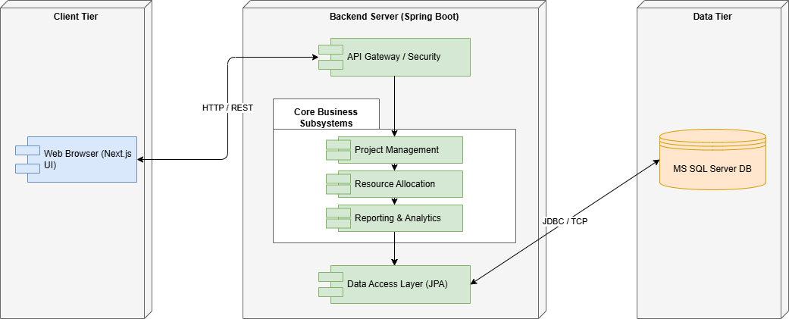
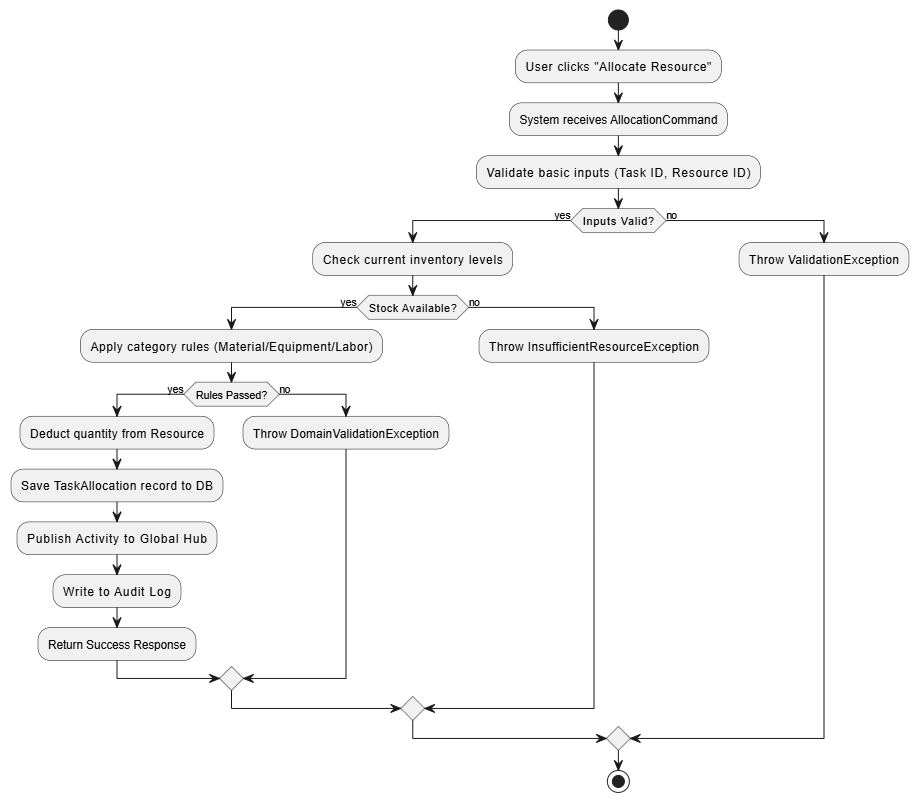
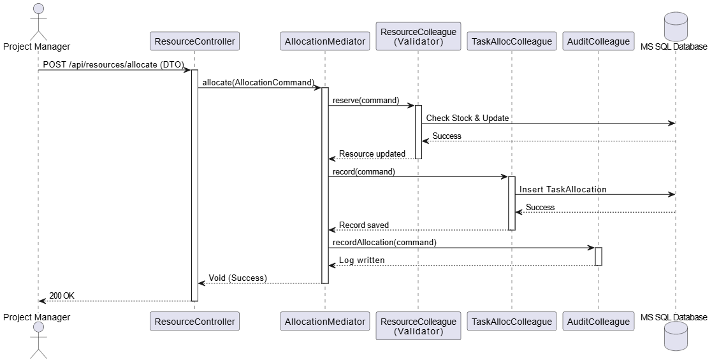
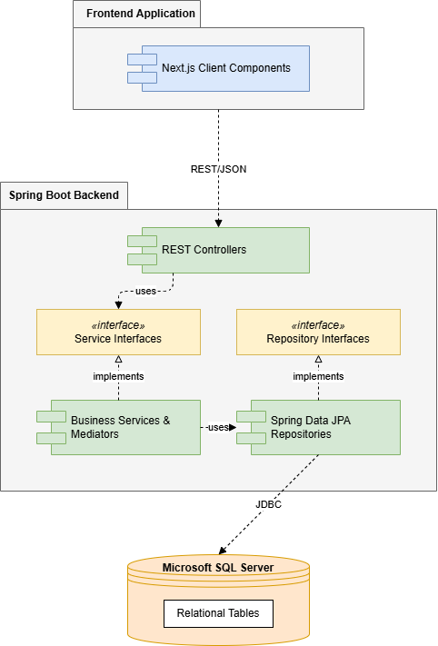
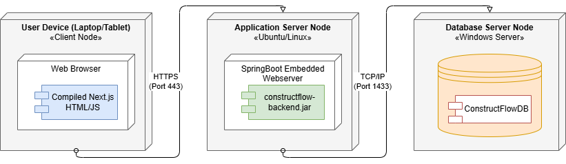
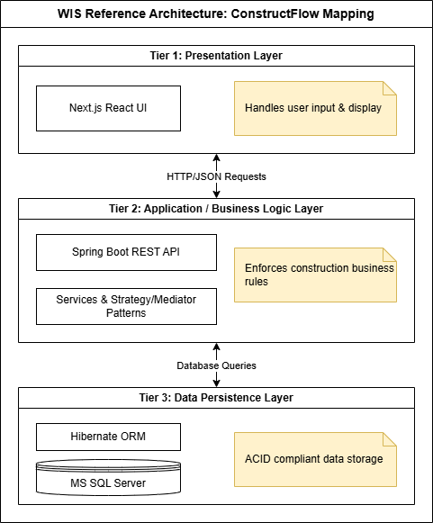

# ConstructFlow — Software Architecture Technical Report

|             |                                                       |
| ----------- | ----------------------------------------------------- |
| **Project** | ConstructFlow: Construction Project Management System |
| **Course**  | C-SW311: Software Design and Development              |
| **Date**    | May 5, 2026                                           |

---

## Table of Contents

1. [Introduction](#1-introduction)
2. [Architectural Design Decisions & Justification](#2-architectural-design-decisions--justification)
3. [Non-Functional Requirements (NFRs)](#3-non-functional-requirements-nfrs)
4. [Conceptual View — Block Diagram](#4-conceptual-view--block-diagram)
5. [Process View — Dynamic Behavior](#5-process-view--dynamic-behavior)
6. [Development View — Component Diagram](#6-development-view--component-diagram)
7. [Physical View — Deployment Diagram](#7-physical-view--deployment-diagram)
8. [Reference Architecture Mapping](#8-reference-architecture-mapping)
9. [References](#9-references)

---

## 1. Introduction

ConstructFlow is a comprehensive, full-stack solution designed to manage the full lifecycle of construction projects. Given the operational complexity inherent to the construction domain — encompassing thousands of concurrent tasks, inventory tracking, resource allocation, and daily progress reporting — a robust, well-reasoned software architecture is not optional but essential.

This report presents the complete architectural design of ConstructFlow, derived from systematic analysis of the system's functional and non-functional requirements. Four complementary architectural viewpoints are employed to ensure traceability between requirements and design:

| Viewpoint       | Purpose                                                      |
| --------------- | ------------------------------------------------------------ |
| **Conceptual**  | High-level subsystem decomposition and logical relationships |
| **Process**     | Runtime dynamic behavior and component interactions          |
| **Development** | Component structure, interfaces, and dependencies            |
| **Physical**    | Deployment mapping to hardware infrastructure nodes          |

Together, these viewpoints offer a complete picture of how ConstructFlow is structured, how it behaves, and how it maps onto the physical infrastructure it runs on.

---

## 2. Architectural Design Decisions & Justification

ConstructFlow's design is governed by three complementary architectural patterns, each chosen to address specific system characteristics and requirements. These patterns operate at different levels of abstraction and work in concert to produce a coherent overall design.

### A. Client-Server Architecture

**Description:** The system is strictly partitioned into two independent tiers:

- A **front-end web client** built with Next.js / React, delivered as a single-page application (SPA)
- A **back-end server** exposing a RESTful API implemented with Spring Boot

**Justification:** Construction managers require rich dashboard capabilities with complex data visualizations, while field engineers need lightweight, fast-responding forms they can operate from tablets on-site. Decoupling the UI from the backend allows each to be independently developed, optimized, and deployed without affecting the other.

**Requirement Traceability:** Directly addresses the requirement for *distributed access*, allowing users on heterogeneous devices to concurrently access a single central system.

---

### B. Layered (N-Tier) Architecture

**Description:** The Spring Boot backend is organized into four strictly ordered, unidirectional layers:

```
Presentation Layer (REST Controllers)
        ↓
Business Logic Layer (Services & Mediators)
        ↓
Data Access Layer (Repositories — Spring Data JPA)
        ↓
Database (Microsoft SQL Server)
```

**Justification:** Construction enterprise software is subject to frequent changes in business logic — for example, the rules governing how progress percentages are calculated or how resource thresholds are enforced. Strict layering guarantees that changes in one layer do not propagate unwanted modifications to other layers. Modifying the database schema does not require touching REST controllers, and vice versa.

**Requirement Traceability:** Satisfies the requirements for *data validation* and *modularity* by ensuring that raw database entities (JPA entities) are always converted into Data Transfer Objects (DTOs) before being exposed to the client tier.

---

### C. Event-Driven Architecture (Internal)

**Description:** Cross-cutting concerns — including audit logging, push notifications, and dashboard counter updates — are handled asynchronously through an internal event bus. This is implemented via the **ActivityHub**, which follows the Observer/Singleton pattern and is implemented as a thread-safe Java `enum` singleton. Publishers emit events; subscribers react independently.

**Justification:** After any significant operation completes (e.g., resource allocation), multiple secondary actions must occur: audit records must be written, dashboards must be updated, and notifications may need to be dispatched. If these were directly coupled to the business logic, the result would be an entangled web of dependencies making the code difficult to test, extend, or modify.

**Requirement Traceability:** Enables *real-time tracking* and audit compliance without blocking or degrading the primary HTTP request-response cycle.

---

### How the Three Patterns Work Together

The three patterns are not independent silos — they are composited into a unified whole:

- **Client-Server** defines the *physical separation* across the network boundary.
- Once a request reaches the server, **Layered Architecture** governs the *synchronous, sequential processing* through the backend tiers toward the database.
- In parallel, **Event-Driven Architecture** asynchronously handles *secondary concerns* (logging, notifications) without coupling them to the main processing pipeline.

This composition results in a system that is simultaneously maintainable, scalable, auditable, and responsive.

---

## 3. Non-Functional Requirements (NFRs)

The architectural choices made in Section 2 have direct, traceable impacts on the system's non-functional quality attributes:

### 3.1 Scalability

The stateless REST API design, inherent to the Client-Server pattern, enables horizontal scaling of the backend. As the contractor's project portfolio grows, the frontend can be scaled via CDN distribution (e.g., Vercel Edge Network), and the backend can be replicated across multiple server instances without requiring shared session state management.

### 3.2 Maintainability

The Layered Architecture is the primary enabler of maintainability. The Data Access Layer (DAL) is fully isolated from the Presentation and Business layers. Swapping the underlying database provider, modifying the SQL schema, or replacing the ORM framework does not necessitate changes in REST controllers or React UI components.

### 3.3 Performance

Performance is addressed at two levels:

- **Data Access Layer:** `PagedRepositoryIterators` are used for paginating large result sets (e.g., Daily Log entries), preventing full table loads into memory and avoiding heap exhaustion under high data volumes.
- **Business Layer:** The Event-Driven `ActivityHub` ensures that audit logging and notification dispatch are non-blocking — they do not hold the HTTP response thread, keeping API response times consistently low.

### 3.4 Security

The Layered Architecture enforces a mandatory security perimeter at the Presentation Layer. All incoming network requests must pass through the `WebConfig` global CORS configuration and any authentication/authorization filters defined in the REST Controllers. There is no path by which client-side code can bypass the Presentation Layer and interact with the database directly.

---

## 4. Conceptual View — Block Diagram

The Conceptual View presents a high-level logical decomposition of the system into its major subsystems and shows the communication pathways between them. It is technology-agnostic and prioritizes clarity of structure over implementation details.



**Explanation:** The Client Application (Next.js running in the Web Browser) communicates with the Backend Server via the HTTP/REST protocol. The Backend Server comprises three core modules — **Project Management**, **Resource Allocation**, and **Reporting & Analytics** — all of which share a single, unified **Data Access Layer (JPA)** to interact with the **MS SQL Server** database. This single access point to the database prevents duplicate data access logic and ensures consistent query behavior across all modules.

---

## 5. Process View — Dynamic Behavior

The Process View describes how the system's components interact at runtime. The **Resource Allocation Workflow** is selected as the primary case study because it exercises the most complex interactions — spanning multiple services, a mediator, database operations, and event publishing.

### 5.1 Activity Diagram

The Activity Diagram describes the logical, step-by-step flow of control when a Project Manager allocates a resource (material or equipment) to a specific task.



**Explanation:** The flow begins when the user submits the allocation form. The system first validates the basic inputs (Task ID and Resource ID). If validation fails, a `ValidationException` is thrown immediately. If valid, the system checks current inventory levels; if stock is insufficient, an `InsufficientResourceException` is raised. Assuming adequate stock, category-specific rules are applied (differing rules apply to Materials, Equipment, and Labor). If the rules are not satisfied, a `DomainValidationException` is raised. On success, the resource quantity is decremented, the `TaskAllocation` record is persisted to the database, an event is published to the `ActivityHub`, the audit log entry is written asynchronously, and a success response is returned to the client.

---

### 5.2 Sequence Diagram

The Sequence Diagram reveals the exact sequence of inter-component messages exchanged during a successful Resource Allocation at the runtime architectural level.



**Explanation:** The Project Manager initiates a `POST /api/resources/allocate` request carrying an allocation DTO. The `ResourceController` (Presentation Layer) delegates to the `AllocationMediator` (Business Logic Layer). The Mediator orchestrates three coordinated operations through its Colleague objects:

1. **ResourceColleague (Validator):** Validates stock and updates the resource quantity in the database — `Check Stock & Update` → `Success`
2. **TaskAllocColleague:** Inserts the `TaskAllocation` record — `Insert TaskAllocation` → `Success`
3. **AuditColleague:** Writes the audit trail entry — `Log written`

Upon completion of all three operations, the Mediator returns `void (Success)` to the Controller, which responds to the client with `HTTP 200 OK`.

This design demonstrates the **Mediator design pattern** in practice: the `AllocationMediator` acts as the central coordinator, preventing the Colleague objects from needing direct references to each other.

---

## 6. Development View — Component Diagram

The Development View describes the internal structure of the software as implemented — the components, the interfaces they expose, and the dependencies between them.



**Explanation:** The Frontend Application (`constructflow-nextjs-frontend`) depends exclusively on the REST/JSON API surface exposed by the Spring Boot backend's REST Controllers. The Controllers are decoupled from implementation classes by depending on `Service Interfaces` rather than concrete classes — enabling substitution and unit testing via mocking. The concrete `Business Services & Mediators` implement these Service Interfaces and in turn use `Repository Interfaces` (Spring Data JPA). The `Spring Data JPA Repositories` connect to the database via JDBC/Hibernate. This full dependency-inversion approach ensures that the system is testable at every layer.



---

## 7. Physical View — Deployment Diagram

The Physical View describes how software artifacts are deployed onto physical (or virtual) hardware nodes and the network protocols used for communication between them.



**Description:** The production deployment spans three distinct nodes:

| Node                            | Stereotype         | Hosted Artifacts                                             | Communication Protocol |
| ------------------------------- | ------------------ | ------------------------------------------------------------ | ---------------------- |
| **User Device** (Laptop/Tablet) | `«Client Node»`    | Web Browser + Compiled Next.js HTML/JS                       | HTTPS (Port 443)       |
| **Application Server**          | `«Ubuntu/Linux»`   | Spring Boot Embedded Webserver + `constructflow-backend.jar` | TCP/IP (Port 1433)     |
| **Database Server**             | `«Windows Server»` | Microsoft SQL Server + `ConstructFlowDB`                     | —                      |

**Deployment Notes:**

- The Spring Boot application uses its embedded Tomcat webserver — no separate servlet container installation is required on the Application Server Node.
- All client-to-server communication is encrypted over HTTPS (TLS) on port 443.
- The Application Server communicates with the Database Server via JDBC over TCP/IP on the standard MS SQL Server port 1433.
- The database is isolated on its own dedicated Windows Server node, following the principle of separation of concerns at the infrastructure level.

---

## 8. Reference Architecture Mapping

Following a systematic comparison with established reference architectures, ConstructFlow maps most precisely to the **Web-based Information System (WIS)** reference architecture — specifically the **Transaction Processing System (TPS)** sub-category [Bass et al., 2021; Fowler, 2002].

**Relevance:** Like all canonical WIS systems, ConstructFlow is fundamentally oriented around the structured capture, storage, retrieval, and reporting of transactional data (Tasks, Resource Allocations, Budget Entries, Daily Logs) through a browser-based interface. Its three-tier organization maps directly onto the WIS reference model's standard tiers.

| WIS Reference Architecture Tier           | ConstructFlow Implementation                                                              |
| ----------------------------------------- | ----------------------------------------------------------------------------------------- |
| **Tier 1 — Presentation**                 | Next.js React UI — handles all user input and data display                                |
| **Tier 2 — Application / Business Logic** | Spring Boot REST API + Services + Mediators — enforces construction domain business rules |
| **Tier 3 — Data Persistence**             | Hibernate ORM + MS SQL Server — ACID-compliant relational data storage                    |

This alignment with a well-documented reference architecture provides several engineering benefits: it makes the design immediately comprehensible to new team members familiar with the WIS pattern, it provides a proven blueprint for handling cross-cutting concerns such as transaction management and session handling, and it establishes a firm foundation for future capability extensions such as reporting dashboards, mobile client support, or integration with third-party construction management platforms.

---

## 9. References

### Software Architecture & Design Patterns

Bass, L., Clements, P., & Kazman, R. (2021). *Software Architecture in Practice* (4th ed.). Addison-Wesley Professional.

Fowler, M. (2002). *Patterns of Enterprise Application Architecture*. Addison-Wesley Professional.

Gamma, E., Helm, R., Johnson, R., & Vlissides, J. (1994). *Design Patterns: Elements of Reusable Object-Oriented Software*. Addison-Wesley Professional. *(The "Gang of Four" — foundational reference for the Mediator and Observer patterns used in ConstructFlow.)*

### Frameworks & Technologies

Spring Framework Documentation. (2025). *Spring Boot Reference Documentation (v3.x)*. VMware Tanzu. https://docs.spring.io/spring-boot/docs/current/reference/html/

Vercel Inc. (2025). *Next.js Documentation — Pages Router & App Router*. https://nextjs.org/docs

Microsoft Corporation. (2025). *SQL Server 2022 Technical Documentation*. https://learn.microsoft.com/en-us/sql/sql-server/

### Architectural Viewpoints

Kruchten, P. (1995). The 4+1 view model of architecture. *IEEE Software*, *12*(6), 42–50. https://doi.org/10.1109/52.469759 *(Foundational paper defining the Conceptual, Process, Development, and Physical views used to structure this report.)*

### Reference Architectures

Kappel, G., Pröll, B., Reich, S., & Retschitzegger, W. (Eds.). (2006). *Web Engineering: The Discipline of Systematic Development of Web Applications*. Wiley. *(Reference for the Web Information System (WIS) architecture classification.)*

### Security

OWASP Foundation. (2024). *OWASP Top Ten: Web Application Security Risks*. https://owasp.org/www-project-top-ten/ *(Informs the security decisions made in the Presentation Layer — CORS configuration, input validation.)*

---

*Report prepared for C-SW311: Software Design and Development | ConstructFlow Team | May 2026*
