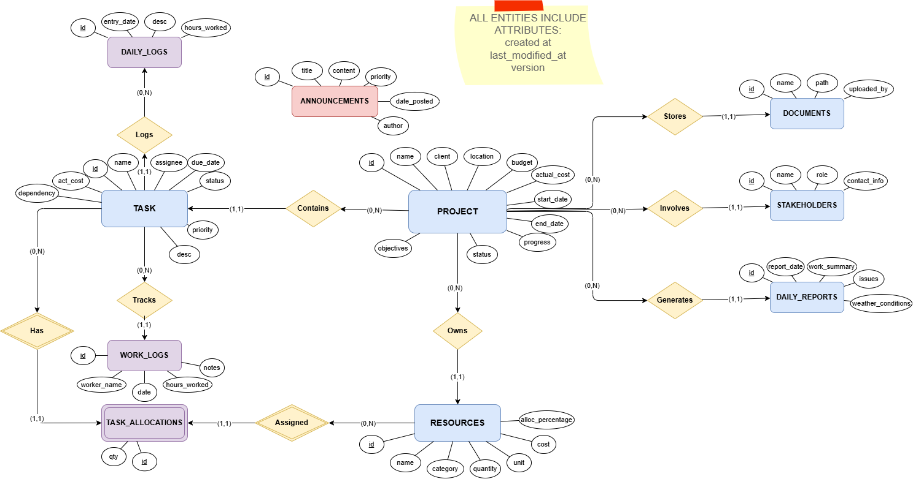

# ConstructFlow Project Management System - Setup & Database Documentation

## Table of Contents
1. [Project Overview](#project-overview)
2. [Prerequisites](#prerequisites)
3. [Installation & Setup](#installation--setup)
4. [Database Configuration](#database-configuration)
5. [Database Schema](#database-schema)
6. [SQL Queries Reference](#sql-queries-reference)

---

## Project Overview

**ConstructFlow** is a comprehensive construction project management system built with:
- **Frontend**: Next.js 14, React, TypeScript, TailwindCSS
- **Backend**: Spring Boot 3.2.1, Java 21, Spring Data JPA
- **Database**: Microsoft SQL Server
- **ORM**: Hibernate with automatic schema management

**Key Features:**
- Project, Task, and Resource Management
- Document Management
- Daily Reports with Automatic Change Tracking
- Global Executive Reports
- Critical Task Prioritization
- Real-time Announcements

---

## Prerequisites

### Required Software
1. **Node.js** (v18+) and npm
2. **Java Development Kit** (JDK 21)
3. **Maven** (v3.8+)
4. **Microsoft SQL Server** (2019+ or Express edition)
5. **SQL Server Management Studio (SSMS)** or Azure Data Studio

### Verify Installations
```bash
node --version  # v18.0.0+
java --version  # 21.0.0+
mvn --version   # 3.8.0+
```

---

## Installation & Setup

### Step 1: Database Setup

1. **Install SQL Server**
   - Download and install SQL Server Express (free) or full edition
   - Note your instance name (e.g., `MSSQLSERVER` or `TEW_SQLEXPRESS`)

2. **Create Database**
   ```sql
   CREATE DATABASE ConstructFlowDB;
   ```

3. **Configure Authentication**
   
   **Option A: SQL Server Authentication**
   - Enable Mixed Mode Authentication in SQL Server Properties
   - Set sa password:
   ```sql
   ALTER LOGIN sa WITH PASSWORD = 'YourStrongPassword123!';
   ALTER LOGIN sa ENABLE;
   ```

   **Option B: Windows Authentication** (Recommended for local development)
   - Ensure your Windows user has sysadmin rights
   - No additional configuration needed

### Step 2: Backend Setup

1. **Navigate to backend directory**
   ```bash
   cd "Constructflow Project management/backend"
   ```

2. **Configure Database Connection**
   
   Edit `src/main/resources/application.properties`:
   
   **For SQL Server Authentication:**
   ```properties
   spring.application.name=backend
   spring.datasource.url=jdbc:sqlserver://localhost:1433;databaseName=ConstructFlowDB;encrypt=true;trustServerCertificate=true;
   spring.datasource.username=sa
   spring.datasource.password=YourStrongPassword123!
   spring.jpa.database-platform=org.hibernate.dialect.SQLServerDialect
   spring.jpa.hibernate.ddl-auto=update
   spring.jpa.show-sql=true
   ```
   
   **For Windows Authentication:**
   ```properties
   spring.application.name=backend
   spring.datasource.url=jdbc:sqlserver://localhost:1433;databaseName=ConstructFlowDB;encrypt=true;trustServerCertificate=true;integratedSecurity=true;
   spring.jpa.database-platform=org.hibernate.dialect.SQLServerDialect
   spring.jpa.hibernate.ddl-auto=update
   spring.jpa.show-sql=true
   ```
   
   **For Named SQL Server Instance:**
   ```properties
   spring.datasource.url=jdbc:sqlserver://localhost\\YOUR_INSTANCE_NAME;databaseName=ConstructFlowDB;encrypt=true;trustServerCertificate=true;integratedSecurity=true;
   ```

3. **Build and Run Backend**
   ```bash
   mvn clean install
   mvn spring-boot:run
   ```
   
   The backend will start on `http://localhost:8080`
   Tables will be created automatically via Hibernate

### Step 3: Frontend Setup

1. **Navigate to frontend directory**
   ```bash
   cd "construct-flow-wireframe (1)"
   ```

2. **Install Dependencies**
   ```bash
   npm install
   ```

3. **Run Development Server**
   ```bash
   npm run dev
   ```
   
   The frontend will start on `http://localhost:3000`

### Step 4: Populate Sample Data (Optional)

Execute the SQL scripts in SSMS:
1. `sample_data.sql` - Creates 15 projects with tasks, resources, and announcements
2. `add_critical_tasks.sql` - Adds critical priority tasks for testing

---

## Database Configuration

### Connection Settings
- **Default Port**: 1433 (SQL Server)
- **Database Name**: ConstructFlowDB
- **Hibernate DDL**: `update` (automatically creates/updates tables)
- **SQL Logging**: Enabled (`show-sql=true`)

### Security Configuration
- **Encryption**: Enabled with `trustServerCertificate=true` for development
- **CORS**: Configured to allow requests from `http://localhost:3000` and `http://localhost:3001`

---

## Database Schema

### Entity Relationship Overview

```
projects (1) ----< (N) tasks
tasks (1) ----< (N) task_allocations >---- (N) resources
projects (1) ----< (N) daily_reports
projects (1) ----< (N) resources
tasks (1) ----< (N) daily_logs
tasks (1) ----< (N) work_logs
projects (1) ----< (N) stakeholders
projects (1) ----< (N) documents

```



### Tables

#### 1. **projects**
Core project information and tracking.

| Column | Type | Description |
|--------|------|-------------|
| id | UNIQUEIDENTIFIER | Primary key (UUID) |
| name | VARCHAR(255) | Project name |
| client | VARCHAR(255) | Client name |
| location | VARCHAR(255) | Project location |
| budget | DECIMAL(19,2) | Total budget |
| actual_cost | DECIMAL(19,2) | Current actual cost |
| start_date | DATE | Project start date |
| end_date | DATE | Project end date |
| progress | DECIMAL(5,2) | Completion percentage (0-100) |
| status | VARCHAR(50) | Status (Active, Completed, On Hold) |
| objectives | TEXT | Project objectives |
| created_at | DATETIME2 | Creation timestamp |
| last_modified_at | DATETIME2 | Last update timestamp |
| version | INTEGER | Optimistic locking version |

#### 2. **tasks**
Individual project tasks and assignments.

| Column | Type | Description |
|--------|------|-------------|
| id | UNIQUEIDENTIFIER | Primary key (UUID) |
| project_id | UNIQUEIDENTIFIER | Foreign key to projects |
| name | VARCHAR(255) | Task name |
| assignee | VARCHAR(255) | Assigned person |
| due_date | DATE | Task deadline |
| status | VARCHAR(50) | Status (Pending, In Progress, Completed) |
| priority | VARCHAR(50) | Priority (Low, Medium, High, Critical) |
| description | TEXT | Task description |
| actual_cost | DECIMAL(19,2) | Task actual cost |
| dependencies | VARCHAR(MAX) | Comma-separated task dependencies |
| created_at | DATETIME2 | Creation timestamp |
| last_modified_at | DATETIME2 | Last update timestamp |
| version | INTEGER | Optimistic locking version |

#### 3. **resources**
Materials, equipment, and labor resources.

| Column | Type | Description |
|--------|------|-------------|
| id | UNIQUEIDENTIFIER | Primary key (UUID) |
| project_id | UNIQUEIDENTIFIER | Foreign key to projects |
| name | VARCHAR(255) | Resource name |
| category | VARCHAR(100) | Category (Material, Equipment, Labor) |
| quantity | DECIMAL(19,2) | Available quantity |
| unit | VARCHAR(50) | Unit of measurement |
| allocation_percentage | DECIMAL(5,2) | Allocation percentage |
| cost | DECIMAL(19,2) | Resource cost |
| created_at | DATETIME2 | Creation timestamp |
| last_modified_at | DATETIME2 | Last update timestamp |
| version | INTEGER | Optimistic locking version |

#### 4. **task_allocations**
Resource allocations to tasks.

| Column | Type | Description |
|--------|------|-------------|
| id | UNIQUEIDENTIFIER | Primary key (UUID) |
| task_id | UNIQUEIDENTIFIER | Foreign key to tasks |
| resource_id | UNIQUEIDENTIFIER | Foreign key to resources |
| quantity | DECIMAL(19,2) | Allocated quantity |
| created_at | DATETIME2 | Creation timestamp |
| last_modified_at | DATETIME2 | Last update timestamp |
| version | INTEGER | Optimistic locking version |

#### 5. **daily_reports**
Daily project progress reports.

| Column | Type | Description |
|--------|------|-------------|
| id | UNIQUEIDENTIFIER | Primary key (UUID) |
| project_id | UNIQUEIDENTIFIER | Foreign key to projects |
| report_date | DATE | Report date |
| work_summary | TEXT | Summary of work performed |
| issues | TEXT | Issues encountered |
| weather_conditions | VARCHAR(255) | Weather conditions |
| created_at | DATETIME2 | Creation timestamp |
| last_modified_at | DATETIME2 | Last update timestamp |
| version | INTEGER | Optimistic locking version |

#### 6. **daily_logs**
Detailed daily task logs.

| Column | Type | Description |
|--------|------|-------------|
| id | UNIQUEIDENTIFIER | Primary key (UUID) |
| task_id | UNIQUEIDENTIFIER | Foreign key to tasks |
| entry_date | DATE | Log date |
| description | TEXT | Log description |
| hours_worked | DECIMAL(5,2) | Hours worked |
| created_at | DATETIME2 | Creation timestamp |
| last_modified_at | DATETIME2 | Last update timestamp |
| version | INTEGER | Optimistic locking version |

#### 7. **work_logs**
Worker time tracking.

| Column | Type | Description |
|--------|------|-------------|
| id | UNIQUEIDENTIFIER | Primary key (UUID) |
| task_id | UNIQUEIDENTIFIER | Foreign key to tasks |
| worker_name | VARCHAR(255) | Worker name |
| date | DATE | Work date |
| hours_worked | DECIMAL(5,2) | Hours worked |
| notes | TEXT | Additional notes |
| created_at | DATETIME2 | Creation timestamp |
| last_modified_at | DATETIME2 | Last update timestamp |
| version | INTEGER | Optimistic locking version |

#### 8. **stakeholders**
Project stakeholders and contacts.

| Column | Type | Description |
|--------|------|-------------|
| id | UNIQUEIDENTIFIER | Primary key (UUID) |
| project_id | UNIQUEIDENTIFIER | Foreign key to projects |
| name | VARCHAR(255) | Stakeholder name |
| role | VARCHAR(100) | Role in project |
| contact_info | VARCHAR(255) | Contact information |
| created_at | DATETIME2 | Creation timestamp |
| last_modified_at | DATETIME2 | Last update timestamp |
| version | INTEGER | Optimistic locking version |

#### 9. **documents**
Project document management.

| Column | Type | Description |
|--------|------|-------------|
| id | UNIQUEIDENTIFIER | Primary key (UUID) |
| project_id | UNIQUEIDENTIFIER | Foreign key to projects |
| name | VARCHAR(255) | Document name |
| file_path | VARCHAR(500) | File storage path |
| uploaded_by | VARCHAR(255) | Uploader name |
| created_at | DATETIME2 | Upload timestamp |
| last_modified_at | DATETIME2 | Last update timestamp |
| version | INTEGER | Optimistic locking version |

#### 10. **announcements**
System-wide announcements.

| Column | Type | Description |
|--------|------|-------------|
| id | UNIQUEIDENTIFIER | Primary key (UUID) |
| title | VARCHAR(255) | Announcement title |
| content | TEXT | Announcement content |
| priority | VARCHAR(50) | Priority (Low, Medium, High, Critical) |
| date_posted | DATETIME2 | Post date |
| author | VARCHAR(255) | Author name |
| created_at | DATETIME2 | Creation timestamp |
| last_modified_at | DATETIME2 | Last update timestamp |
| version | INTEGER | Optimistic locking version |

---

## SQL Queries Reference

### Standard CRUD Operations

All entities support standard Create, Read, Update, Delete operations via Spring Data JPA.

#### Standard Pattern (Example: Projects)

```sql
-- CREATE
INSERT INTO projects (id, name, client, location, budget, actual_cost, start_date, end_date, progress, status, objectives, created_at, last_modified_at, version)
VALUES (NEWID(), ?, ?, ?, ?, ?, ?, ?, ?, ?, ?, GETDATE(), GETDATE(), 0);

-- READ (Find by ID)
SELECT * FROM projects WHERE id = ?;

-- UPDATE (with Optimistic Locking)
UPDATE projects 
SET name=?, client=?, location=?, budget=?, actual_cost=?, start_date=?, end_date=?, progress=?, status=?, objectives=?, last_modified_at=GETDATE(), version=version+1
WHERE id=? AND version=?;

-- DELETE (with Optimistic Locking)
DELETE FROM projects WHERE id=? AND version=?;

-- READ ALL (Paginated)
SELECT * FROM projects ORDER BY created_at DESC OFFSET ? ROWS FETCH NEXT ? ROWS ONLY;
```

### Custom Queries by Repository

#### ProjectRepository

```sql
-- findByNameContainingIgnoreCase
SELECT * FROM projects WHERE LOWER(name) LIKE LOWER(?);

-- findByStatus
SELECT * FROM projects WHERE status = ?;

-- getTotalBudget (Aggregate)
SELECT SUM(budget) FROM projects;

-- getAverageActualCost (Aggregate)
SELECT AVG(actual_cost) FROM projects;

-- findHighValueProjects (Sub-query)
SELECT p.* FROM projects p 
WHERE p.budget > (SELECT AVG(p2.budget) FROM projects p2);
```

#### TaskRepository

```sql
-- findByProjectId
SELECT * FROM tasks WHERE project_id = ?;

-- findByNameContainingIgnoreCase
SELECT * FROM tasks WHERE LOWER(name) LIKE LOWER(?);

-- findByPriority
SELECT * FROM tasks WHERE priority = ?;

-- findExpensiveTasks (Sub-query)
SELECT t.* FROM tasks t 
WHERE t.actual_cost > (SELECT AVG(t2.actual_cost) FROM tasks t2);

-- findCriticalTasks
SELECT t.* FROM tasks t 
WHERE LOWER(t.priority) = 'critical' 
ORDER BY t.due_date;
```

#### ResourceRepository

```sql
-- findByNameContainingIgnoreCase
SELECT * FROM resources WHERE LOWER(name) LIKE LOWER(?);

-- findByCategory
SELECT * FROM resources WHERE category = ?;

-- findResourcesInActiveProjects (Complex Join)
SELECT DISTINCT r.* FROM resources r
JOIN task_allocations ta ON r.id = ta.resource_id
JOIN tasks t ON ta.task_id = t.id
JOIN projects p ON t.project_id = p.id
WHERE p.status = 'Active';
```

#### DailyReportRepository

```sql
-- findByProjectId
SELECT * FROM daily_reports WHERE project_id = ?;
```

#### DailyLogRepository

```sql
-- findByTaskId
SELECT * FROM daily_logs WHERE task_id = ?;

-- findLogsByProjectLocation (Complex Join)
SELECT dl.* FROM daily_logs dl
JOIN tasks t ON dl.task_id = t.id
JOIN projects p ON t.project_id = p.id
WHERE p.location = ?;

-- findTasksUsingResourceCategory (Complex Join)
SELECT DISTINCT t.* FROM tasks t
JOIN task_allocations ta ON t.id = ta.task_id
JOIN resources r ON ta.resource_id = r.id
WHERE r.category = ?;
```

#### WorkLogRepository

```sql
-- findByTaskId
SELECT * FROM work_logs WHERE task_id = ?;
```

#### StakeholderRepository

```sql
-- findByProjectId
SELECT * FROM stakeholders WHERE project_id = ?;
```

#### DocumentRepository

```sql
-- findByProjectId
SELECT * FROM documents WHERE project_id = ?;

-- findByNameContainingIgnoreCase
SELECT * FROM documents WHERE LOWER(name) LIKE LOWER(?);
```

#### TaskAllocationRepository

```sql
-- findByTaskId
SELECT * FROM task_allocations WHERE task_id = ?;

-- findByResourceId
SELECT * FROM task_allocations WHERE resource_id = ?;
```

### Service-Level Queries

#### AnalyticsService - Dashboard Statistics

```sql
-- Count all projects
SELECT COUNT(*) FROM projects;

-- Count active projects
SELECT COUNT(*) FROM projects WHERE LOWER(status) = 'active';

-- Count all tasks
SELECT COUNT(*) FROM tasks;

-- Count pending tasks
SELECT COUNT(*) FROM tasks WHERE LOWER(status) = 'pending';

-- Sum of all project budgets
SELECT SUM(budget) FROM projects;

-- Sum of all project actual costs
SELECT SUM(actual_cost) FROM projects;
```

#### AnalyticsService - Advanced Statistics

```sql
-- Total Budget (Aggregate)
SELECT SUM(p.budget) FROM projects p;

-- Average Actual Cost (Aggregate)
SELECT AVG(p.actual_cost) FROM projects p;

-- High Value Projects (Sub-query)
SELECT p.* FROM projects p 
WHERE p.budget > (SELECT AVG(p2.budget) FROM projects p2);

-- Expensive Tasks (Sub-query)
SELECT t.* FROM tasks t 
WHERE t.actual_cost > (SELECT AVG(t2.actual_cost) FROM tasks t2);

-- Resources in Active Projects (Complex Join)
SELECT DISTINCT r.* FROM resources r
JOIN task_allocations ta ON r.id = ta.resource_id
JOIN tasks t ON ta.task_id = t.id
JOIN projects p ON t.project_id = p.id
WHERE p.status = 'Active';
```

#### ProjectService - Progress Calculation

```sql
-- Get all tasks for a project
SELECT * FROM tasks WHERE project_id = ?;

-- Update project progress (calculated from task completion)
UPDATE projects 
SET progress = ?, last_modified_at = GETDATE(), version = version + 1
WHERE id = ? AND version = ?;
```

#### ResourceService - Inventory Update

```sql
-- Update resource quantity
UPDATE resources 
SET quantity = quantity + ?, last_modified_at = GETDATE(), version = version + 1
WHERE id = ? AND version = ?;
```

#### TaskAllocationService

```sql
-- Create allocation
INSERT INTO task_allocations (id, task_id, resource_id, quantity, created_at, last_modified_at, version)
VALUES (NEWID(), ?, ?, ?, GETDATE(), GETDATE(), 0);

-- Find allocations by task
SELECT * FROM task_allocations WHERE task_id = ?;

-- Delete allocation
DELETE FROM task_allocations WHERE id = ?;
```

### Ad-hoc Queries

#### Global Report Generation

```sql
-- Get all projects with tasks count
SELECT p.id, p.name, p.status, COUNT(t.id) as task_count
FROM projects p
LEFT JOIN tasks t ON p.id = t.project_id
GROUP BY p.id, p.name, p.status;

-- Get project with tasks filtered by status
SELECT p.*, t.* FROM projects p
LEFT JOIN tasks t ON p.id = t.project_id
WHERE p.status = ?
ORDER BY p.created_at DESC;
```

#### Search Operations

```sql
-- Search projects by name
SELECT * FROM projects WHERE LOWER(name) LIKE LOWER(CONCAT('%', ?, '%'));

-- Search tasks by name
SELECT * FROM tasks WHERE LOWER(name) LIKE LOWER(CONCAT('%', ?, '%'));

-- Search documents by name
SELECT * FROM documents WHERE LOWER(name) LIKE LOWER(CONCAT('%', ?, '%'));
```

---

## API Endpoints Reference

### Projects
- `GET /api/projects` - Get all projects (paginated)
- `GET /api/projects/{id}` - Get project by ID
- `POST /api/projects` - Create new project
- `PUT /api/projects/{id}` - Update project
- `DELETE /api/projects/{id}` - Delete project

### Tasks
- `GET /api/tasks` - Get all tasks (paginated)
- `GET /api/tasks/{id}` - Get task by ID
- `GET /api/tasks/project/{projectId}` - Get tasks by project
- `GET /api/tasks/critical` - Get all critical priority tasks
- `POST /api/tasks` - Create new task
- `PUT /api/tasks/{id}` - Update task
- `DELETE /api/tasks/{id}` - Delete task

### Resources
- `GET /api/resources` - Get all resources (paginated)
- `GET /api/resources/{id}` - Get resource by ID
- `POST /api/resources` - Create new resource
- `PUT /api/resources/{id}` - Update resource
- `PUT /api/resources/{id}/inventory` - Update inventory quantity
- `DELETE /api/resources/{id}` - Delete resource

### Analytics
- `GET /api/analytics/dashboard` - Get dashboard statistics
- `GET /api/analytics/advanced` - Get advanced statistics (aggregates, sub-queries, joins)

### Documents
- `GET /api/documents` - Get all documents
- `POST /api/documents` - Upload new document
- `DELETE /api/documents/{id}` - Delete document

### Announcements
- `GET /api/announcements` - Get all announcements
- `POST /api/announcements` - Create announcement
- `DELETE /api/announcements/{id}` - Delete announcement

### Reports
- `GET /api/analytics/dashboard` - Get dashboard statistics for global report
- `GET /api/analytics/advanced` - Get advanced analytics (aggregates, sub-queries, joins)

---

## Application Features

### 1. Dashboard
- Overview of all projects and tasks
- Critical Tasks section showing tasks with "Critical" priority
- Quick statistics and recent activities
- Real-time announcements

### 2. Projects Management
- Create, edit, and delete projects
- Track project budget, actual cost, and progress
- View project details including client, location, and dates
- Monitor project status (Active, Completed, On Hold)

### 3. Tasks Management
- Create and assign tasks to projects
- Four priority levels: **Low**, **Medium**, **High**, **Critical**
- Track task status: Pending, In Progress, Completed
- Set due dates and assignees
- Allocate resources to tasks
- View critical tasks separately

### 4. Resources Management
- Manage materials, equipment, and labor
- Track resource categories and quantities
- Update daily inventory levels
- Allocate resources to specific tasks
- Monitor resource costs

### 5. Documents Management
- Upload and organize project documents
- Folder-based organization
- View documents by project
- Document search functionality

### 6. **Reports Section** ⭐ NEW
Accessible via the sidebar "Reports" menu.

#### Daily Reports
- **User-Entered Data**: Document daily activities, issues, and completion percentage
- **Automatic Change Tracking**: System automatically detects and displays:
  - Projects created or modified on the selected date
  - Tasks created or modified on the selected date
  - Resources created or modified on the selected date
- **Real-time Updates**: Changes displayed immediately upon selecting a date
- **Comprehensive Summary**: Combines manual entries with automated system logs

#### Global Report (Executive Summary)
- **High-Level Statistics**:
  - Total Budget vs Actual Cost
  - Active Projects count
  - Pending Tasks count
- **Financial Health**: Budget utilization percentage with visual progress bar
- **Critical Alerts**: Warnings for overdue tasks or budget overruns
- **Print-Friendly**: Built-in print functionality for physical reports
- **Real-time Data**: Fetched directly from backend analytics endpoints

### 7. Announcements
- Create system-wide announcements
- Set priority levels for announcements
- View announcement history

---

## User Interface Sections

### Sidebar Navigation
1. **Dashboard** - Main overview
2. **Projects** - Project management
3. **Tasks** - Task management
4. **Resources** - Resource tracking
5. **Documents** - Document library
6. **Reports** - Daily and Global reports ⭐ NEW
7. **Announcements** - System announcements

---

## Troubleshooting

### Backend won't start
- **Check SQL Server is running**: Services → SQL Server (MSSQLSERVER/Instance Name)
- **Verify database exists**: Use SSMS to confirm ConstructFlowDB exists
- **Check credentials**: Ensure username/password in application.properties is correct
- **Port conflicts**: Ensure port 8080 is not in use

### Frontend can't connect to backend
- **Verify backend is running**: Check http://localhost:8080/api/projects
- **CORS errors**: Ensure WebConfig.java has correct allowed origins
- **Port conflicts**: Ensure port 3000 is not in use

### Database connection errors
- **TCP/IP not enabled**: Enable TCP/IP in SQL Server Configuration Manager
- **Wrong port**: Default is 1433, verify your SQL Server port
- **Firewall**: Ensure Windows Firewall allows SQL Server connections
- **Authentication mode**: Verify SQL Server authentication mode matches your configuration

---

## Project Structure

```
ConstructFlow/
├── backend/
│   ├── src/main/java/com/constructflow/
│   │   ├── controller/     # REST API endpoints
│   │   ├── service/        # Business logic
│   │   ├── repository/     # Data access layer
│   │   ├── model/          # Entity classes
│   │   ├── dto/            # Data transfer objects
│   │   └── config/         # Configuration (CORS, etc.)
│   ├── src/main/resources/
│   │   └── application.properties
│   └── pom.xml
│
└── construct-flow-wireframe/
    ├── app/                # Next.js pages
    ├── components/         # React components
    ├── lib/                # Utilities and context
    └── package.json
```

---

## Support

For issues or questions:
1. Check the console logs (backend and frontend)
2. Verify database connection in SSMS
3. Ensure all services are running
4. Check the troubleshooting section above

---

**Version**: 1.0  
**Last Updated**: December 2024
